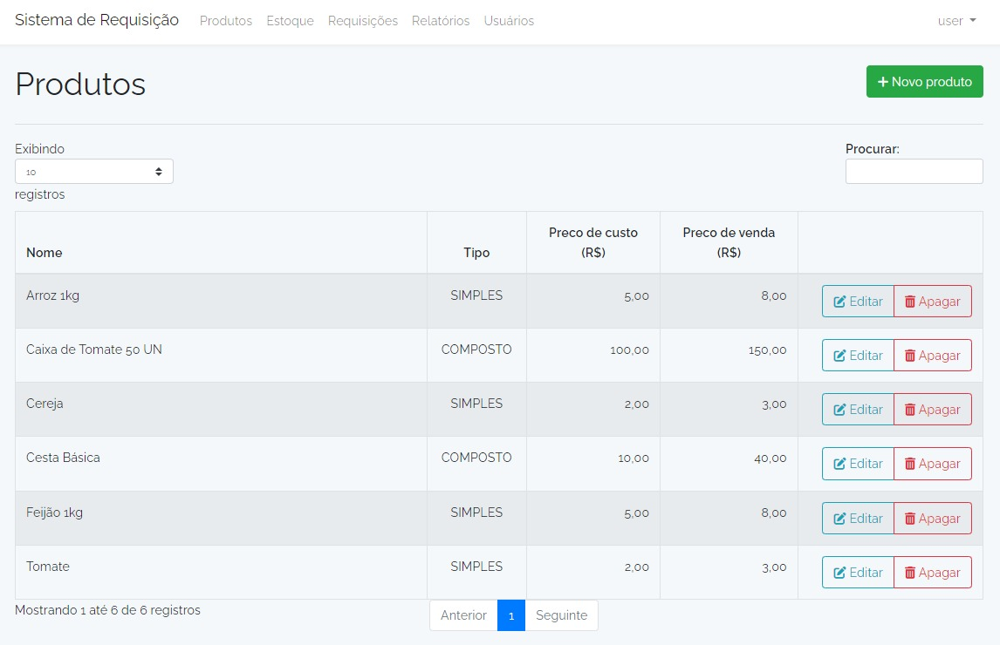
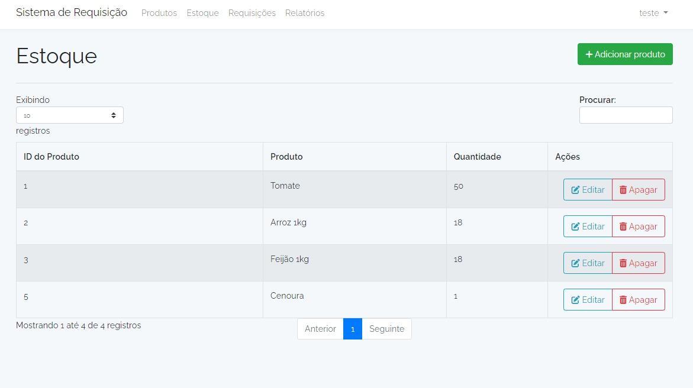
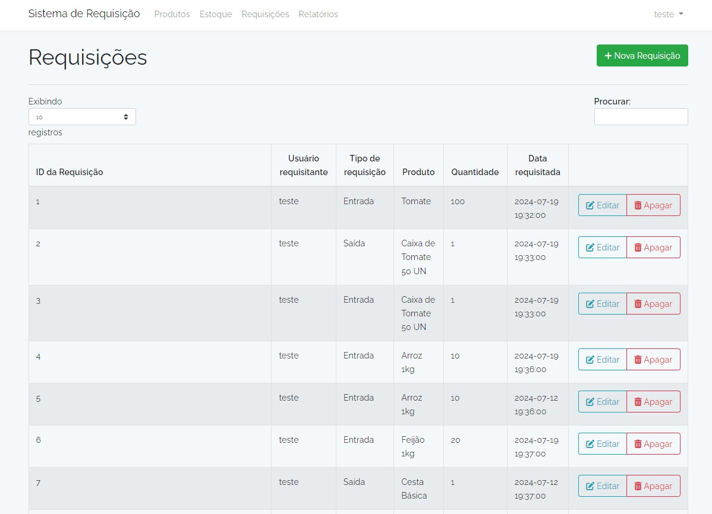
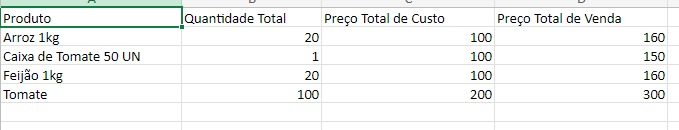
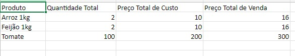

# Sistema de Requisição de Produtos

## Tecnologias usadas:

- PHP 7.3.10
- Laravel 5.6
- MYSQL 8
- JavaScript Vanilla
- JQuery
- DataTables
- Maatwebsite Excel (Biblioteca para exportar arquivos em excel)
- Biblioteca Select2
- Biblioteca Sweetalert2

## Considerações:

- Toda a documentação (arquivos de sql, diagrama uml e diagrama entidade relacionamento se encontram na pasta "documents").
- Usar php artisan db:seed --class=UserSeeder para criação de usuário com nível admin, mas se preferir usar opção registrar na tela inicial virá como usuário comum como padrão.
- ACL foi implementado com níveis admin e user.
- Não foi usado migrations, todas as tabelas foram criadas com sql puro que se encontram em "documents".
- Foi usado trigger para melhorar performance e integridade do banco.
- Os relatórios estão sendo exportados via excel

## 1º - Clonar o repositório
```
git clone https://github.com/victorhartung/sistema_produtos.git
```
## 2º - Instalar as dependências e bibliotecas do projeto
```
composer install ou composer require
```
## 3º - Cria o arquivo .env para as configurações
```
cp .env.example .env
```
## 4º - Gerar a key do laravel
```
php artisan key:generate
```
## 5º - Inicia o servidor
```
php artisan server
```

## Imagens
<p>Página de Produtos</p>

<hr>
<p>Página de Estoque</p>

<hr>
<p>Página de Requisições</p>

<hr>
<p>Relatório de Entrada</p>

<hr>
<p>Relatório de Saída</p>



